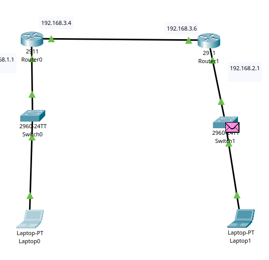

# Multi Routing Network



```
[PC1]---Switch1---(192.168.1.1)Router1(192.168.3.4)---GE0/1
                                               |
                                        (192.168.3.6)Router2(192.168.2.1)---Switch2---[PC2]
```

## Router 1 Configuration

```
en
conf t
interface gigabitEthernet 0/0
ip address 192.168.1.1 255.255.255.0
no shutdown
exit

interface gigabitEthernet 0/1
ip address 192.168.3.4 255.255.255.0
no shutdown
exit

```

## Router 2 Configuration

```
en
conf t
interface gigabitEthernet 0/0
ip address 192.168.2.1 255.255.255.0
no shutdown
exit

interface gigabitEthernet 0/1
ip address 192.168.3.6 255.255.255.0
no shutdown
exit

```

## Static Routing

Commmand

```
ip route destination musk next hope
```

### Router 1

```
ip route 192.168.2.0 255.255.255.0 192.168.3.6
```

### Router 2

```
ip route 192.168.1.0 255.255.255.0 192.168.3.4
```
