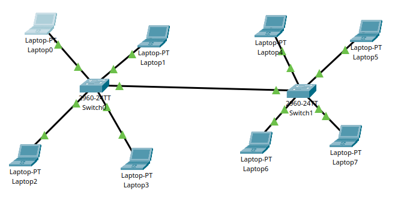
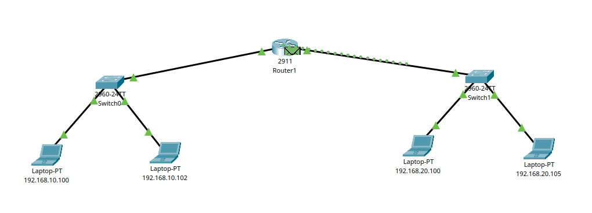
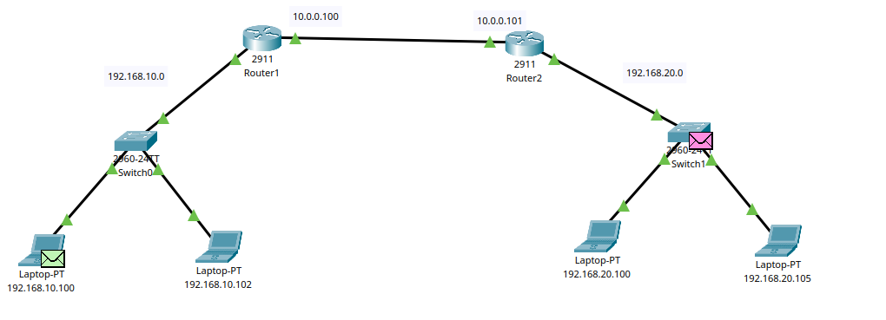

# Cisco Packet Tracer

🔶 What is a VLAN?

A VLAN (Virtual Local Area Network) is a logical grouping of devices in a network — regardless of their physical location — as if they were on the same local network segment.

## VLAN on a Cisco Switch

### Step 1: Create VLAN

```
Switch(config)# vlan 10
Switch(config-vlan)# name HR
```

### Step 2: Assign VLAN to Port

```
Switch(config)# interface f0/1
Switch(config-if)# switchport mode access
Switch(config-if)# switchport access vlan 10

```

## Making VLAN

\*\*Device 0,1,6,7 are on vlan10 and device 2,3,4,5 on vlan 20\*\*


### Switch 1

```
enable
configure terminal
interface range fastEthernet 0/1-2
switchport mode access
switchport acess vlan 10
exit

interface range fastEthernet 0/3-4
switchport mode access
switchport acess vlan 20
exit

interface fastEthernet 0/5
switchport mode trunk
exit
```

### Switch 2

```
enable
configure terminal
interface range fastEthernet 0/1-2
switchport mode access
switchport acess vlan 20
exit

interface range fastEthernet 0/3-4
switchport mode access
switchport acess vlan 10
exit

interface fastEthernet 0/5
switchport mode trunk
exit
```

# Inter-VLAN Communication / Inter-VLAN Routing



## Without sub interface

```
enable
configure terminal
interface gigabitEthernet 0/0
ip address 192.168.10.1 255.255.255.0
no shutdown
exit

interface gigabitEthernet 0/1
ip address 192.168.20.1 255.255.255.0
no shutdown
exit

```

## Inter Vlan-Routing with subinterface

This 2nd option

```
enable
configure terminal
interface gigabitEthernet 0/0
no shutdown
exit

interface gigabitEthernet 0/0.10
encapsulation dot1Q 10
ip address 192.168.10.1 255.255.255.0
no shutdown
exit

interface gigabitEthernet 0/0.20
encapsulation dot1Q 20
ip address 192.168.20.1 255.255.255.0
no shutdown
exit

```

# Routing Between VLANs Across Routers



### Static Routing

```
ip route [DESTINATION_NETWORK] [SUBNET_MASK] [NEXT_HOP_IP or EXIT_INTERFACE]

```

### Router-1

```

en
conf t

# setup switch

interface gigabitEthernet 0/0
ip address  192.168.10.1 255.255.255.0
no shutdown
exit

# setup with router 1

interface gigabitEthernet 0/1
ip address  10.0.0.100 255.0.0.0
no shutdown
exit

# static routing
ip route 192.168.20.0 255.255.255.0 10.0.0.101

```

### Router-2

```

en
conf t

# setup switch

interface gigabitEthernet 0/0
ip address  192.168.20.1 255.255.255.0
no shutdown
exit

# setup with router 1

interface gigabitEthernet 0/1
ip address  10.0.0.101 255.0.0.0
no shutdown
exit

# static routing

ip route 192.168.10.0 255.255.255.0 10.0.0.100

```

# Multi Level Vlan And Routing

1. switch 1 has 3 vlan
2. switch 2 has 3 vlan
3. switch 3 has 3 vlan

- 1.1,2.1,3.1 are in same vlan 10 and defualt gateway 192.168.10.1
- 1.2,2.2,3.2 are in same vlan 20 and defualt gateway 192.168.20.1
- 1.3,2.3,3.3 are in same vlan 30 and defualt gateway 192.168.30.1

- As i connected router on switch 2, so i need to these port in vlan:
  let switch f0/10 connected router g0/0 and it working 192.168.10.1 so f0/10 must be connected to vlan 10.

### Create 3 vlan Each Switch

### Router Configuration

```
en
conf t

## Network 1

interface g0/0
ip address 192.168.10.1 255.255.255.0
no shutdown
exit

## Network 2

interface g0/1
ip address 192.168.20.1 255.255.255.0
no shutdown
exit

## Network 3

interface g0/2
ip address 192.168.30.1 255.255.255.0
no shutdown
exit

```

### Configure Switch2 for Vlan

```
enable
configure terminal
interface  fastEthernet 0/10
switchport mode access
switchport acess vlan 10
exit


interface  fastEthernet 0/11
switchport mode access
switchport acess vlan 20
exit

interface  fastEthernet 0/12
switchport mode access
switchport acess vlan 30
exit
```
